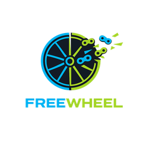

<p align="center">
  
</p>

# FreeWheel

**Custom firmware launcher for the Bowflex Velocore bike.**

FreeWheel replaces the stock JRNY app with [VeloLauncher](https://github.com/ril3y/velo-platform) — an open-source fitness platform that lets you ride with Netflix, track workouts, and use the bike without a subscription.

No command-line tools, Android SDK, or USB cable required. Just download, run, and follow 3 steps.

## Setup

### Step 1: Enable ADB on the bike

1. Power on your Velocore bike and wait for the JRNY boot screen
2. **Tap the top-right corner of the screen 9 times rapidly** — this opens the hidden "Advanced User Actions" menu
3. Open the **Utility App**
4. The Utility App enables ADB over WiFi automatically (port 5555)
5. Leave the Utility App running — do NOT close it

### Step 2: Run FreeWheel on your PC

1. Download `freewheel.exe` from [Releases](https://github.com/ril3y/freewheel/releases)
2. Run it (no installation needed)
3. Click **Scan Network** — FreeWheel will find your bike on the local network
4. If scan doesn't find it, enter the bike's IP address manually

### Step 3: Jailbreak

1. Click **Pre-Check** — verifies your bike is compatible (Android 9, Rockchip board, correct JRNY version)
2. Click **Jailbreak!**
3. **On the bike**: tap **Allow** when the USB debugging authorization prompt appears
4. Wait for the 8-step process to complete (~2 minutes)
5. The bike will restart with VeloLauncher as the home screen

If anything fails, FreeWheel automatically restores the bike to stock.

## What gets installed

| App | Purpose |
|-----|---------|
| **VeloLauncher** | Custom home screen — workouts, free ride, media overlay, ride history, settings, OTA updates |
| **SerialBridge** | Platform-signed service that bridges the bike's hardware sensors to Android apps |

## Features

- **Structured workouts** with segments, difficulty scaling, and auto-pause when you stop pedaling
- **Free ride** mode — just ride and track stats
- **Netflix/YouTube overlay** — watch media with floating ride stats on top
- **5-4-3-2-1 countdown** before workouts start
- **Ride summary** after every workout (calories, power, RPM, distance, heart rate)
- **Ride history** with streak tracking
- **OTA updates** — the launcher checks for updates from GitHub automatically
- **Third-party fitness app support** via the WorkoutSession API

## Restore to stock

Open FreeWheel and click **Restore Stock**. Everything reverts to the original JRNY experience in ~1 minute.

## Troubleshooting

**Can't find the bike on the network?**
- Make sure your PC and bike are on the same WiFi network
- Make sure the Utility App is running on the bike
- Try entering the bike's IP address manually (check your router's connected devices)

**"Pre-Check failed"?**
- Only Velocore C9/C10 bikes are supported (Android 9, Rockchip board)
- JRNY version 2.25.1 is tested; other versions may work but aren't guaranteed

**Bike stuck after jailbreak?**
- Swipe up from the bottom edge of the screen to get home (invisible gesture zone)
- If completely stuck, use FreeWheel's Restore Stock feature from your PC

## Building from source

```bash
go build -o freewheel.exe ./cmd/freewheel
```

Requires Go 1.25+ with Fyne GUI toolkit.

## Related

- [velo-platform](https://github.com/ril3y/velo-platform) — VeloLauncher source, SerialBridge, fitness SDK
- [Developer Guide](https://github.com/ril3y/velo-platform/blob/main/DEVELOPER.md) — Build fitness apps for the platform

## License

MIT
